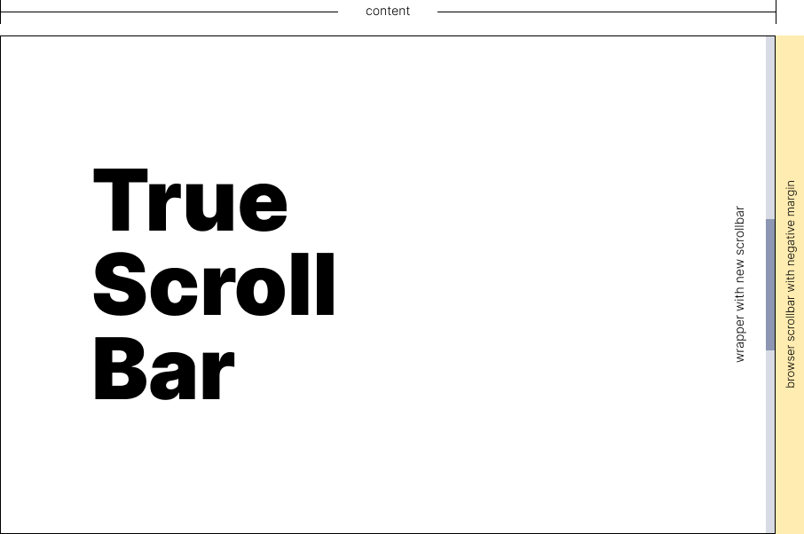

# TrueScrollBar

TrueScrollBar - light weight custom scrollbar library (min.css + min.js ~ **7kB**)

- The library does not remove the native scroll. She hides it.
- Appearance is easy to customize with CSS
- Browser support IE11+
- Vanilla js

---



## Todo

1. Install
2. Use
3. Put a star on [GitHub](https://github.com/lugin-design/truescrollbar)

## Usage

### Install with NPM
```JavaScript
npm i @lugindev/truescrollbar
```

```JavaScript
import TrueScrollBar from '@lugindev/truescrollbar'
import '@lugindev/truescrollbar/TrueScrollBar.min.css'
```

### From CDN [jsdelivr](https://www.jsdelivr.com/package/npm/@lugindev/truescrollbar?path=src)

```HTML
<link rel="stylesheet" href="https://cdn.jsdelivr.net/npm/@lugindev/truescrollbar@1/src/TrueScrollBar.min.css">
<script src="https://cdn.jsdelivr.net/npm/@lugindev/truescrollbar@1/src/TrueScrollBar.min.js"></script>
```

### Use in JS
```JavaScript
const el = document.querySelector('.you-element')
new TrueScrollBar(el)

// with options
new TrueScrollBar(document.body, {takeMarkup: true})

```
### Use in VUE
```HTML
<template lang="pug">

   div($ref='myScroll')
       p TrueScrollBar ease to use and customize
       p TrueScrollBar ease to use and customize
       p TrueScrollBar ease to use and customize

</template>

<script>
   import TrueScrollBar from '@lugindev/truescrollbar'
   import '@lugindev/truescrollbar/TrueScrollBar.min.css'

   export default {
       mounted() {
           new TrueScrollBar(this.$refs.myScroll)
       }
   }
</script>

<style lang="sass">
   .tsb-scroll
       // customize
</style>
```

## Options

```JavaScript
{
    // Render TrueScrollBar only desktop
    // I see no reason to replace scrollbar on mobile
    // {Boolean} default: false
    desktopOnly: false,

    // If true: scrollbar will take up space in the markup
    // Default scrollbar is position: absolute
    // {Boolean} default: false
    takeMarkup: false,

    // Enable reading right to left direction
    // {Boolean} default: false
    rtl: false
}
```